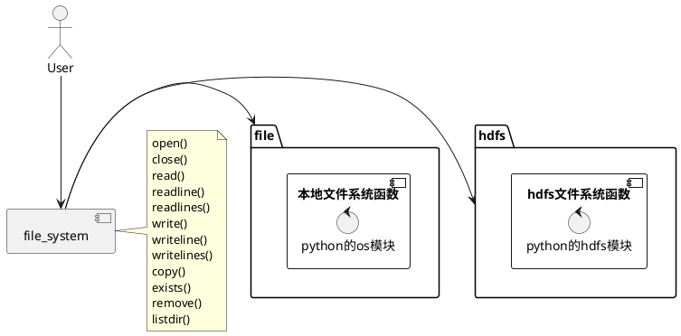

## File System Python API

Unified interface for file system, An wrapper to compat some common file system.

We can only support hdfs and file protocol at present.

### Standard

Standard to use: <protocol>://<url><absolute_path>




#### local file system

* standard: file://<absolute_path>

* example:  file:///home/ts/test.txt


#### hdfs

* standard: hdfs://[<ip|hostname>:<port>]<absolute_path>

* example:  hdfs://10.147.20.122:50070/user/ts/test.txt

#### How to use

```bash
pip install -r requirements.txt -i https://pypi.tuna.tsinghua.edu.cn/simple
```
